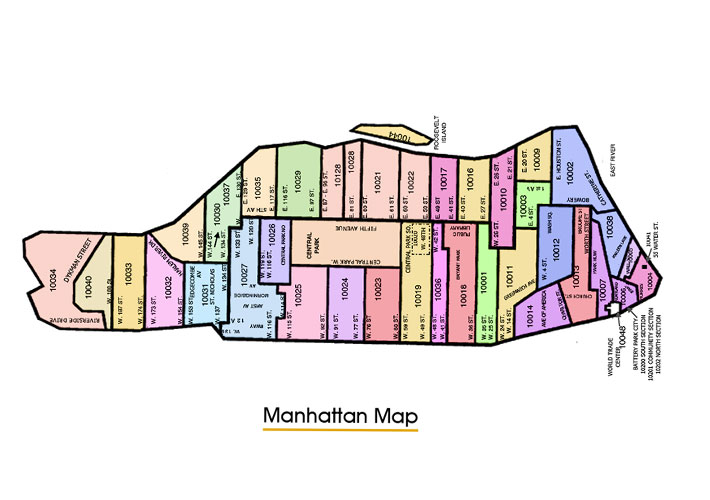

# Taxi Analysis Python Version 2 Readme #

Analysis on simple algorithm to advise Taxi Drivers which zip code to drive to in order to maximise earnings. Analysis of simulation results can be found in the juypter notebook html files.

### Setting up python and dependencies ###

* Install Anaconda [Anaconda Downloadpage](https://docs.continuum.io/anaconda/install/)
* run `make create_environment` in the root directory to download and install dependencies
* run `source activate sot-env` to initialise the environment

### Preprocess Data ###
If one wishes to calculate preprocess data again
* Run `make preprocess_data` from the terminal

### Running the Application ###

Before running any commands
run `source activate sot-env` to initialise the environment (if
not already initialised)

To observe stick or twist demo run `jupyter notebook notebooks/Stick\ Or\ Twist\ Demo.ipynb`

To run the Stick or Twist large simulation run `jupyter notebook notebooks/Large\ Simulation.ipynb`
   
### Running tests ###

to run all tests
`make run_tests`

to see test coverage 
`make run_tests_with_coverage`

